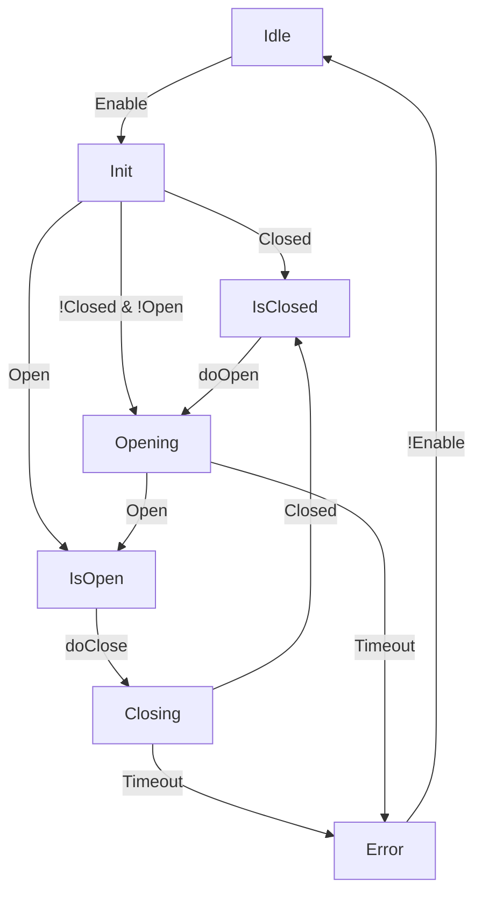

[//]: # (Table des matières)
## Table des matières
- [Introduction](#Introduction)
- [Méthodologie](#methode)
- [Résultats](#resultats)
- [Conclusion](#conclusion)

[//]: # (Exemple titres)
# Titre1
## Titre2
### Titre3
#### Titre4
##### Titre5

[//]: # (Liste à puces)
- Elément1
- Elément2
- Elément3
  - Sous-élément1
  - Sous-élément2
    - Sous-sous-élément

[//]: # (Liste à points)
1. Premier point
2. Deuxième point
3. Troisième point

[//]: # (Mise en forme)
*Italique*
**Gras**
~~texte barré~~
**_Gras-italique_**

[//]: # (Exemple tableau)
| Nom    | Âge | Ville     |
|:------:|:----:|:--------:|
| Alice  |  25 | Paris     |
| Bob    |  30 | Lyon      |
| Charlie|  22 | Marseille |

[//]: # (Ligne séparation)
---

[//]: # (Image)


[//]: # (Citation)
> Ceci est une citation.

[//]: # (Bouts de code)
```python
# Exemple en Python
for i in range(5):
    print(i)
```


